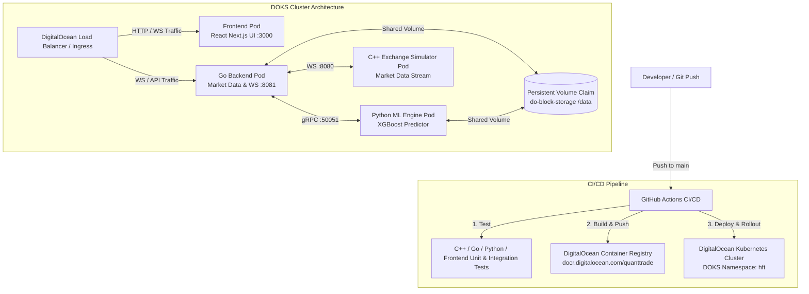

# Cloud Deployment & CI/CD Architecture — DigitalOcean Kubernetes (DOKS)

This document details the production deployment strategy and automated CI/CD pipeline for hosting the **QuantTrade HFT Platform** on **DigitalOcean Kubernetes (DOKS)**.

---

## 1. High-Level Architecture



### Component Roles:
1. **GitHub Actions CI/CD**: Automatically runs multi-language unit tests, builds Docker container images, pushes to DOCR, and deploys updates to DOKS.
2. **DigitalOcean Container Registry (DOCR)**: Private container registry storing immutable image tags (`${{ github.sha }}`).
3. **DigitalOcean Kubernetes (DOKS)**: Managed K8s cluster running persistent containerized services under the `hft` namespace.
4. **Persistent Volume (`do-block-storage`)**: Provides shared block storage (`/data`) for market data tick logs and trained ML models.

---

## 2. Kubernetes Workload & Pod Breakdown

All platform services operate in the `hft` namespace:

| Service / Component | Workload Type | Replicas | Container Image | Port(s) | Function & Resources |
| :--- | :--- | :---: | :--- | :--- | :--- |
| **Frontend UI** | `Deployment` | 1 Pod | `quanttrade/hft-frontend` | `3000` (HTTP) | React / Next.js live dashboard (`250m-500m CPU`, `256Mi-512Mi RAM`) |
| **Go Backend** | `Deployment` | 1 Pod | `quanttrade/hft-backend` | `8081` (WS), `9090` (gRPC) | Market data ingestion & WS server (`500m-1000m CPU`, `512Mi-1Gi RAM`) |
| **ML Engine** | `Deployment` | 1 Pod | `quanttrade/ml-predictor` | `50051` (gRPC) | XGBoost inference engine (`1000m-2000m CPU`, `1Gi-2Gi RAM`) |
| **Exchange Simulator** | `CronJob` / `Pod` | 1 Pod | `quanttrade/exchange-sim` | `8080` (WS) | C++ market data simulator (`500m-1000m CPU`, `256Mi-512Mi RAM`) |

> **Total Cluster Pods:** **3 Persistent Pods** + **1 Simulation Pod** (4 Pods total).

---

## 3. Automated CI/CD Pipeline (GitHub Actions)

The pipeline workflow (`.github/workflows/ci-cd.yml`) automates build, test, and deployment:

### Pipeline Stages:
1. **Parallel Multi-Language Testing**:
   - `test-cpp`: Compiles C++20 core engine with GCC 13 & CMake, executes latency benchmark tests.
   - `test-go`: Runs `go vet` and concurrency race-detector unit tests (`go test -race ./...`).
   - `test-python-ml`: Runs `pytest` on Python XGBoost predictor.
   - `test-frontend`: Performs static TypeScript verification (`tsc --noEmit`).
2. **Container Image Build & Push**:
   - Authenticates to **DigitalOcean Container Registry (DOCR)** via `doctl`.
   - Builds 4 Docker images concurrently using `docker/build-push-action`.
   - Tags images with commit SHA (`${{ github.sha }}`) and `latest`.
3. **Kubernetes Rollout**:
   - Connects to DOKS using `doctl kubernetes cluster kubeconfig save`.
   - Applies manifests (`deployment/k8s/platform-services.yaml` and `simulation-cronjob.yaml`).
   - Executes zero-downtime rolling updates (`kubectl rollout status`).

---

## 4. DigitalOcean Cluster Infrastructure Setup

### Cluster Prerequisites:
* **Node Pool**: 2 x `s-2vcpu-4gb` (or 1 x `s-4vcpu-8gb`) Droplet nodes.
* **Storage Class**: `do-block-storage` attached to `hft-shared-data-pvc` (`20Gi`).

### One-Time Setup Commands:
```bash
# 1. Create DigitalOcean Kubernetes Cluster
doctl kubernetes cluster create quanttrade-doks-cluster \
  --region nyc1 \
  --node-pool "name=hft-pool;size=s-2vcpu-4gb;count=2"

# 2. Create Container Registry
doctl registry create quanttrade-registry

# 3. Connect Registry to DOKS Cluster
doctl kubernetes cluster registry add quanttrade-doks-cluster
```

---

## 5. Backup & Disaster Recovery (DR) Plan

1. **Persistent Volume Snapshots**:
   - Enable daily automated snapshots on DigitalOcean Block Storage volumes attached to `/data`.
2. **Cluster & Manifest Backups (Velero)**:
   - Automated daily backup of `hft` namespace manifests and PVs to DigitalOcean Spaces object storage.
3. **Instant Deployment Rollback**:
   - Rollback to any previous deployment version in under 10 seconds:
     ```bash
     kubectl rollout undo deployment/hft-backend-deploy -n hft
     ```
