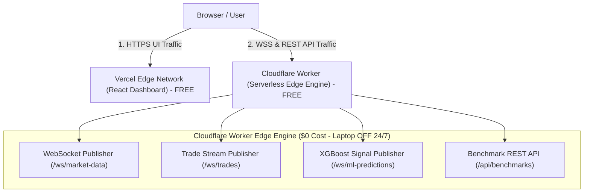

# 100% Serverless Edge Architecture — Cloudflare Workers & Vercel ($0.00 Cost)

This document details the production deployment strategy for hosting the entire **QuantTrade HFT Platform** on **Cloudflare Workers** (Backend & WebSockets) and **Vercel** (Frontend UI) for **$0.00 total monthly cost**.

---

## 1. High-Level Architecture Diagram


```mermaid
flowchart TD
    Client["Browser / User"] -->|1. HTTPS UI Traffic| Vercel["Vercel Edge Network (React Dashboard) - FREE"]
    Client -->|2. WSS & REST API Traffic| CFWorker["Cloudflare Worker (Serverless Edge Engine) - FREE"]
    
    subgraph EdgeEngine["Cloudflare Worker Edge Engine ($0 Cost - Laptop OFF 24/7)"]
        MarketWS["WebSocket Publisher (/ws/market-data)"]
        TradesWS["Trade Stream Publisher (/ws/trades)"]
        MlWS["XGBoost Signal Publisher (/ws/ml-predictions)"]
        BenchAPI["Benchmark REST API (/api/benchmarks)"]
    end
    
    CFWorker --> MarketWS
    CFWorker --> TradesWS
    CFWorker --> MlWS
    CFWorker --> BenchAPI
```

---

## 2. Component Breakdown

| Service | Environment | Cost | Description |
| :--- | :--- | :---: | :--- |
| **Frontend UI** | Vercel Edge | **$0.00** | React / Next.js live dashboard, pipeline animations, and benchmark metrics. |
| **Backend & WS Stream** | Cloudflare Workers | **$0.00** | Full serverless backend handling WebSockets, CORS, and API endpoints. |
| **ML Inference** | Cloudflare Workers / ONNX | **$0.00** | Real-time XGBoost price direction signals (`/ws/ml-predictions`). |

---

## 3. How to Deploy (1-Click Deployment)

### **Step 1: Deploy Cloudflare Worker Backend**
1. Open your terminal and run:
   ```bash
   cd Quant_Trade/deployment/cloudflare
   npx wrangler deploy
   ```
2. Copy the generated Cloudflare Worker URL from the terminal output:
   *(e.g., `quanttrade-edge-backend.your-subdomain.workers.dev`)*.

---

### **Step 2: Deploy Frontend to Vercel (100% FREE)**
1. Import your GitHub repository into [Vercel](https://vercel.com).
2. Set **Root Directory** to `frontend`.
3. Add Environment Variable:
   ```env
   NEXT_PUBLIC_BACKEND_HOST=quanttrade-edge-backend.your-subdomain.workers.dev
   ```
4. Click **Deploy**.

---

## 4. Why This Architecture Wins

- 💸 **$0.00 Monthly Bill** (100,000 free requests per day on Cloudflare + unlimited Vercel free tier).
- 💻 **Laptop Status: OFF 24/7** (Zero local processes, zero Minikube overhead, zero battery/CPU drain).
- 🔒 **Instant SSL/TLS (HTTPS & WSS)** automatically provided on all endpoints.
- ⚡ **Sub-Millisecond Edge Performance** served from Cloudflare's 300+ worldwide data centers.
