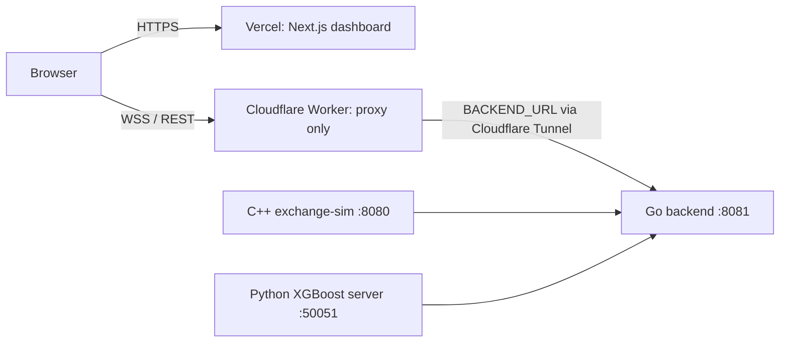

# Deployment — Vercel + Cloudflare Worker proxy + real backend

## 1. Architecture


```mermaid
flowchart LR
    Browser["Browser"] -->|HTTPS| Vercel["Vercel: Next.js dashboard"]
    Browser -->|WSS / REST| Worker["Cloudflare Worker: proxy only"]
    Worker -->|BACKEND_URL via Cloudflare Tunnel| Go["Go backend :8081"]
    Sim["C++ exchange-sim :8080"] --> Go
    ML["Python XGBoost server :50051"] --> Go
```

| Part | Where it runs | Notes |
| :--- | :--- | :--- |
| Frontend | Vercel (free) | Root Directory: `Quant_Trade/frontend` |
| Worker | Cloudflare (free) | **Generates no data.** It only forwards `/ws/*` and `/api/*` to `BACKEND_URL`. If unset or unreachable it returns 503 and the dashboard shows "Backend Offline". |
| Go backend, C++ exchange-sim, Python ML | **Your machine or a server** | These cannot run on Cloudflare Workers (native processes). |

> The exchange-sim is a market **simulator**. The numbers are real output of this
> engine, but the market itself is simulated.

## 2. Run the real backend (WSL or Linux)

```bash
cd /mnt/d/hft/Quant_Trade/Quant_Trade
make run     # build + start ML server, Go backend, recorder, exchange-sim
make tail    # logs
make stop    # stop everything
```

Check: `http://localhost:8081/health`

## 3. Expose it with Cloudflare Tunnel (free)

```powershell
winget install Cloudflare.cloudflared
cloudflared tunnel --url http://localhost:8081
```

Copy the printed `https://....trycloudflare.com` URL. It changes on every restart.

## 4. Point the Worker at it

In `deployment/cloudflare/wrangler.toml`:

```toml
[vars]
BACKEND_URL = "https://....trycloudflare.com"
```

Deploy:

```powershell
cd Quant_Trade/deployment/cloudflare
npx wrangler deploy
```

CI deploys automatically on push to `main` if the GitHub secret
`CLOUDFLARE_API_TOKEN` is set (otherwise the step is skipped with a warning).

## 5. Vercel environment variables

| Key | Value |
| :--- | :--- |
| `NEXT_PUBLIC_WS_URL` | `wss://quanttrade-edge-backend.quanttrade-tech.workers.dev` |
| `NEXT_PUBLIC_API_URL` | `https://quanttrade-edge-backend.quanttrade-tech.workers.dev` |

## 6. Limits

- Data only flows while the backend machine and the tunnel are running.
- For 24/7 uptime, run the same stack on a VPS and use its URL as `BACKEND_URL`.
