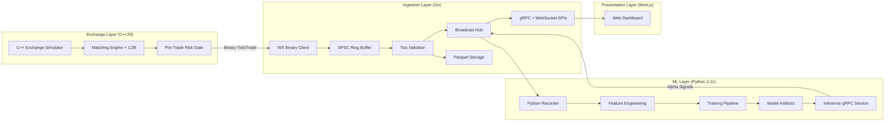
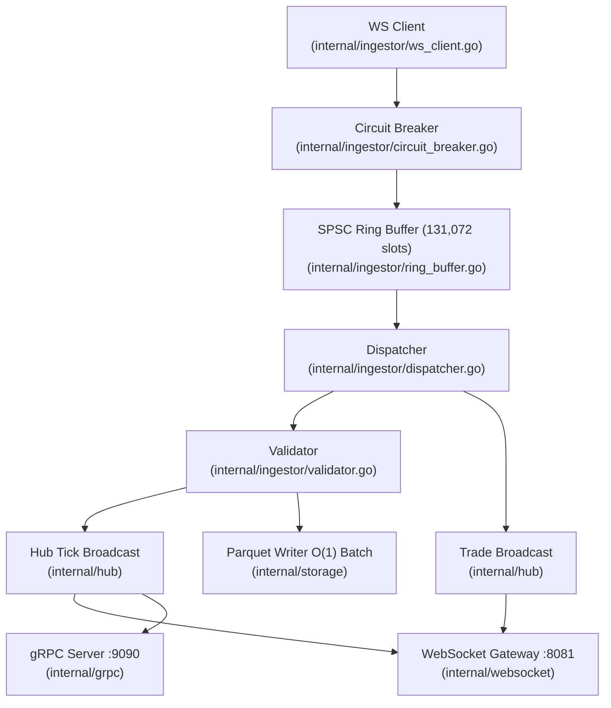
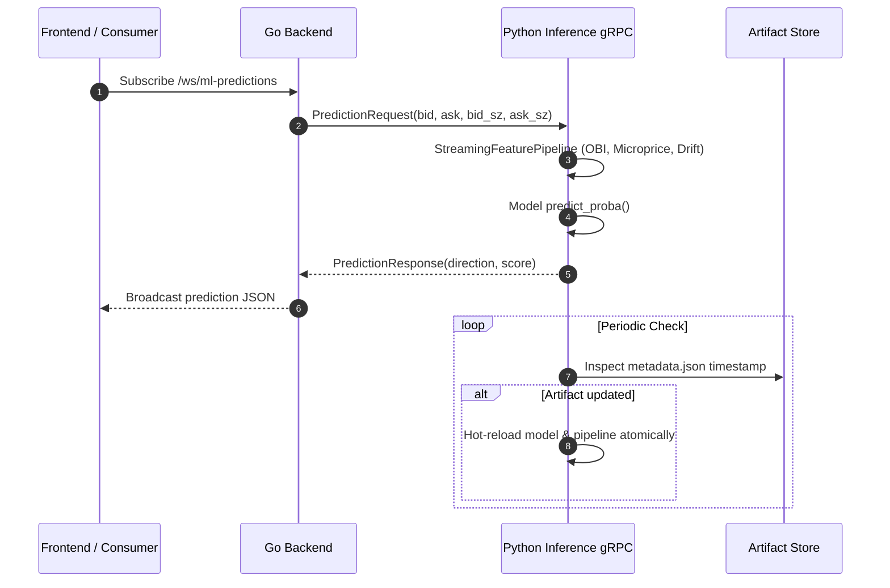
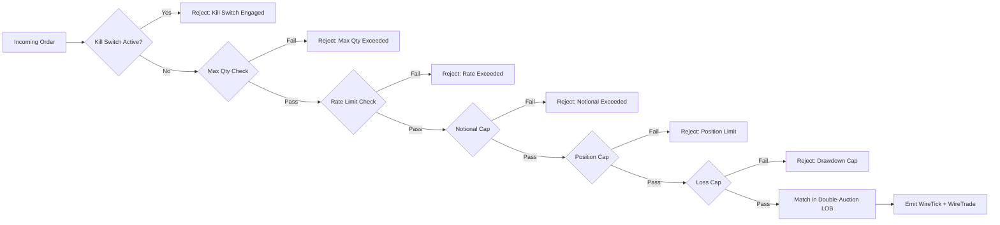
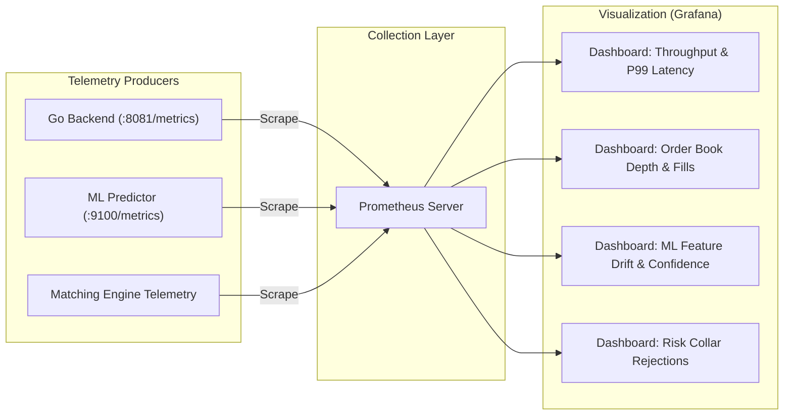

# QuantTrade HFT Platform

An institutional-grade, event-driven High-Frequency Trading (HFT) and Quantitative Market Simulation platform built with **C++20**, **Go**, **Python 3.11**, and **Next.js 14**.

---

## 1. System Summary

QuantTrade is a polyglot, event-driven high-frequency trading simulation and execution platform operating across four decoupled runtime tiers:

* **C++20 Exchange Engine**: Deterministic matching engine, Order Book (LOB), stochastic market maker with Brownian price walk, and aggressive noise order flow.
* **Go Ingestion Gateway**: High-throughput binary wire deserialization, lock-free SPSC ring buffering, $O(1)$ batch Parquet persistence, and real-time WebSocket broadcast hub.
* **Python ML Pipeline**: Online feature engineering pipeline, LightGBM directional alpha prediction, and sub-millisecond gRPC inference server with atomic hot-reload.
* **Next.js 14 Frontend**: Real-time trading dashboard featuring a 25Hz frame batching buffer and 5Hz rolling price-action visualization deployed on Vercel and K3s.

---

## 2. High-Level Design (HLD)

### 2.1 Logical Architecture



### 2.2 System Design Overview


### 2.3 Runtime Endpoints & Protocols

| Component | Protocol | Endpoint / Port | Description |
| :--- | :--- | :--- | :--- |
| **Exchange Simulator** | Binary WS | `ws://hft-exchange-sim-svc:8080/ws/market-data` | High-frequency binary tick & trade publisher |
| **Go Backend (Market Data)** | JSON WS | `ws://hft-backend-svc:8081/ws/market-data` | Real-time L1/L2 Order Book snapshots |
| **Go Backend (Trade Tape)** | JSON WS | `ws://hft-backend-svc:8081/ws/trades` | Real-time executed trade fills (`BUY`/`SELL`) |
| **Go Backend (ML Stream)** | JSON WS | `ws://hft-backend-svc:8081/ws/ml-predictions` | Directional alpha probabilities |
| **Go Backend REST/Metrics** | HTTP | `http://hft-backend-svc:8081/metrics` | Prometheus scraping and benchmark metrics |
| **Go Backend gRPC** | gRPC | `hft-backend-svc:9090` | Market data gRPC server |
| **Python ML Inference** | gRPC / HTTP | `hft-ml-predictor-svc:50051` / `:9100/metrics` | Inference engine and ML Prometheus metrics |
| **Cloudflare Tunnel** | HTTPS/WSS | `https://*.trycloudflare.com` | Edge tunnel routing directly to Kubernetes Ingress |
| **Production Frontend** | HTTPS | `https://quant-trade-phi.vercel.app/dashboard` | Live Next.js dashboard deployed on Vercel |

---

## 3. Low-Level Design (LLD)

### 3.1 Ingestion Internals (Go)



### 3.2 ML Inference Request Path



### 3.3 Exchange Matching & Pre-Trade Risk Gate



---

## 4. Kubernetes Deployments

### 4.1 Production Cluster (AWS EC2 / K3s)

Production manifests are structured in `deployment/k8s/*.prod.yaml`:

```bash
# 1. Apply production platform manifests
kubectl apply -f deployment/k8s/platform-services.prod.yaml
kubectl apply -f deployment/k8s/simulation-cronjob.prod.yaml

# 2. Check cluster health
kubectl get pods -n hft
```

#### Production Architecture Highlights:
* **`hft-backend-deploy`**: High-speed Go router with $O(1)$ non-blocking Parquet persistence (Memory Limit: `1536Mi`, CPU Limit: `1000m`).
* **`hft-ml-predictor-deploy`**: LightGBM gRPC predictor with Prom metrics on port 9100.
* **`hft-exchange-sim-continuous`**: Continuous 24/7 C++ exchange simulator with infinite runtime (`--duration 0`).
* **`cloudflared-tunnel.service`**: Systemd edge SSL tunnel routing external traffic directly to K3s Traefik ingress.

---

### 4.2 Local Cluster (Minikube)

Local manifests are located in `deployment/k8s/platform-services.yaml` and `simulation-cronjob.yaml`.

#### Automated Deployment (Windows):
```cmd
scripts\deploy_local.bat
```

#### Manual Deployment:
```bash
# 1. Start Minikube & point Docker daemon
minikube start --cpus=4 --memory=4096
eval $(minikube docker-env)

# 2. Build local container images
docker build -t quant_trade/exchange-sim:latest -f exchange-sim/Dockerfile .
docker build -t quant_trade/hft-backend:latest -f backend-go/Dockerfile .
docker build -t quant_trade/ml-predictor:latest -f ml/Dockerfile .
docker build -t quant_trade/hft-frontend:latest -f frontend/Dockerfile .

# 3. Apply manifests
kubectl apply -f deployment/k8s/platform-services.yaml
kubectl apply -f deployment/k8s/simulation-cronjob.yaml

# 4. Port forward to access locally
kubectl port-forward svc/hft-frontend-svc -n hft 3000:3000
kubectl port-forward svc/hft-backend-svc -n hft 8081:8081
```

Dashboard access: `http://localhost:3000/dashboard`

---

## 5. Feed Rate Tuning & Scaling Guide

The exchange simulator defaults to **`1,000 – 1,200 msg/s`** (the optimal rate for cloud Free Tier efficiency and low-bandwidth web streaming).

To adjust or stress-test higher throughput, edit `SIM_NOISE_US` in the ConfigMap (`deployment/k8s/simulation-cronjob.prod.yaml`):

| Target Throughput | `SIM_NOISE_US` Value | Use Case |
| :--- | :--- | :--- |
| **`1,000 msg/s`** (Default) | `10000` (10ms) | Production dashboard, zero-cost AWS Free Tier ($0/mo), low bandwidth. |
| **`2,500 msg/s`** | `4000` (4ms) | High-activity intraday trading session simulation. |
| **`5,000 msg/s`** | `2000` (2ms) | Stress testing WebSocket gateway and client buffer absorption. |
| **`10,000+ msg/s`** | `500` (500µs) | Colocation burst simulation and matching engine benchmarking. |

### Applying Feed Rate Changes Without Recompiling:
```bash
# 1. Apply updated YAML
kubectl apply -f deployment/k8s/simulation-cronjob.prod.yaml

# 2. Restart the simulator pod
kubectl rollout restart deployment hft-exchange-sim-continuous -n hft
```

---

## 6. Observability & Planned Grafana Roadmap



### Key Metrics Exported:
* **Go Backend Metrics** (`http://<backend>:8081/metrics`):
  * `hft_ticks_ingested_total`: Counter of valid market ticks ingested.
  * `hft_trades_executed_total`: Counter of executed trade fills broadcasted.
  * `hft_ringbuffer_depth`: Depth of SPSC ingestor queue.
  * `hft_ingest_latency_nanoseconds`: End-to-end ingestion latency histogram.
  * `hft_circuit_breaker_state`: Connection status (`0` = Closed/OK, `1` = Open/Tripped).

* **Python ML Metrics** (`http://<ml-predictor>:9100/metrics`):
  * `ml_predict_requests_total`: Prediction count by status (`ok`, `error`).
  * `ml_predict_duration_seconds`: Histogram of ML inference latency.

---

## 7. Operations Cheatsheet

```bash
# Rollout restart all cluster deployments
kubectl rollout restart deployment -n hft

# Rollback to previous deployment revision
kubectl rollout undo deployment/hft-backend-deploy -n hft
kubectl rollout undo deployment/hft-exchange-sim-continuous -n hft

# Stream live container logs
kubectl logs -l app=backend -n hft -f
kubectl logs -l app=exchange-sim -n hft -f
kubectl logs -l app=ml-predictor -n hft -f

# Check cluster resource utilization
kubectl top pods -n hft
kubectl top nodes
```

---

## 8. Repository Structure

```text
Quant_Trade/
├── backend-go/             # Go 1.22 ingestion, validation, SPSC ring buffer & WebSockets
├── core-cpp/               # C++20 low-latency matching engine, LOB & cacheline structures
├── exchange-sim/           # Synthetic market maker with Brownian drift & noise generator
├── ml/                     # Python 3.11 streaming feature pipeline, LightGBM & gRPC server
├── frontend/               # Next.js 14 real-time dashboard with 25Hz batching & charts
├── proto/                  # Protobuf schemas for market data, risk, and predictions
├── configs/                # Runtime configuration YAMLs (dev, prod)
├── deployment/
│   └── k8s/                # Kubernetes manifests (Minikube & AWS K3s production)
├── scripts/
│   └── deploy_local.bat    # 1-click Minikube automated deployment script
├── docker-compose.yml      # Local container compose configuration
└── README.md               # Project architecture and developer guide
```

---

## 9. License

This project is licensed under the **MIT License**.
