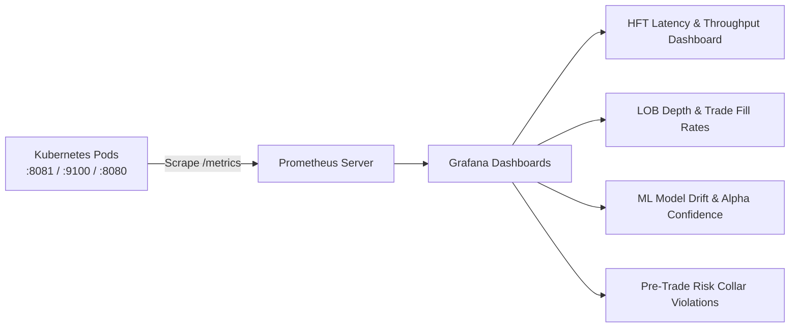

# QuantTrade HFT Platform

An institutional-grade, event-driven High-Frequency Trading (HFT) and Quantitative Market Simulation platform built with **C++20**, **Go**, **Python 3.11**, and **Next.js 14**.

---

## 1. System Overview & Architecture

QuantTrade is engineered across four decoupled runtime tiers to guarantee deterministic sub-microsecond order execution, resilient high-throughput data fan-out, real-time ML directional inference, and low-overhead client visualization:

```mermaid
flowchart LR
    subgraph L1[Exchange & Matching Engine — C++20]
        MM[Market Maker]
        NT[Noise Trader]
        ME[Lock-Free Matching Engine]
        RG[Pre-Trade Risk Gate]
        WSP[Binary WebSocket Publisher]
    end

    subgraph L2[Ingestion & Distribution — Go]
        WSC[WS Binary Ingestor]
        CB[Circuit Breaker]
        RB[Lock-Free SPSC Ring Buffer]
        DISP[Dispatcher]
        VAL[Tick Validator]
        PQ[Non-Blocking O(1) Parquet Storage]
        HUB[Market & Trade Broadcast Hub]
        WSG[JSON WebSocket Gateway :8081]
    end

    subgraph L3[Machine Learning — Python 3.11]
        PIPE[Streaming Feature Pipeline]
        MOD[LightGBM Alpha Predictor]
        GRPC[Inference Engine :50051]
    end

    subgraph L4[Presentation & Cloud Edge]
        CFT[Cloudflare SSL Tunnel]
        VCL[Next.js Dashboard on Vercel]
        K3S_UI[In-Cluster Next.js UI :3000]
    end

    MM -->|Quotes + Price Drift| ME
    NT -->|Aggressive Market/Limit Orders| ME
    ME --> RG --> WSP
    WSP -->|WireTick & WireTrade Binaries| WSC
    WSC --> CB --> RB --> DISP
    DISP --> VAL --> PQ
    DISP --> HUB
    HUB -->|gRPC Request| GRPC --> MOD
    HUB --> WSG
    WSG --> CFT --> VCL
    WSG --> K3S_UI
```

---

## 2. Low-Level Design (LLD)

### 2.1 C++20 Core Matching Engine & Exchange Simulator (`core-cpp/` & `exchange-sim/`)
* **Matching Engine**: Continuous double-auction price-time priority ($O(1)$ lookup via memory-pooled cacheline-aligned `OrderNode` instances).
* **Brownian Price Drift**: `MarketMaker` quotes both sides of the book while applying continuous stochastic random walks to simulate realistic price volatility.
* **Order Flow Simulation**: `NoiseTrader` injects 60% aggressive spread-crossing `MARKET` orders and 40% passive `LIMIT` orders, driving continuous trade executions into the Trade Tape.
* **Continuous Execution**: Runs continuously in synthetic mode (`--duration 0` for infinite continuous simulation) or deterministic replay mode (`--replay`).

### 2.2 Go Market Data Ingestor & Router (`backend-go/`)
* **Binary Deserialization**: High-speed zero-alloc parsing of `WireTick` (43 bytes) and `WireTrade` (51 bytes) packets.
* **SPSC Ring Buffer**: Decouples network I/O from disk writes and downstream client broadcasts.
* **$O(1)$ Non-Blocking Parquet Storage**: Asynchronous batch appends avoiding memory locks and preventing Out-Of-Memory (`OOMKilled`) crashes.
* **Circuit Breaker & Gap Detection**: Automatic reconnect with exponential backoff and sequence gap alerting.

### 2.3 Python ML Directional Alpha Predictor (`ml/`)
* **Microstructure Features**: Order Book Imbalance (OBI), volume-weighted microprice, bid-ask spread deviation, and EWMA log-return momentum.
* **gRPC Inference**: Async sub-millisecond predictions served on port `50051` with Prometheus metrics on port `9100`.
* **Atomic Model Hot-Reload**: Thread-safe hot swapping of trained model artifacts without restarting running pods.

### 2.4 Next.js 14 Web Dashboard (`frontend/`)
* **25Hz Frame Batching Buffer**: Ticks and trade fills queue in a mutable microsecond buffer and flush at 25 FPS (every 40ms), keeping client frame rates at a smooth **60 FPS** without browser thread saturation.
* **5Hz Rolling Chart Downsampling**: Downsamples chart history to 5Hz so 60 data points represent 12 seconds of real-time price trend curves.

---

## 3. Runtime Endpoints & Data Contracts

| Component | Protocol | Endpoint / Port | Description |
| :--- | :--- | :--- | :--- |
| **Exchange Simulator** | Binary WS | `ws://hft-exchange-sim-svc:8080/ws/market-data` | High-frequency binary tick & trade stream |
| **Go Backend (Market Data)** | JSON WS | `ws://hft-backend-svc:8081/ws/market-data` | Real-time L1/L2 Order Book snapshots |
| **Go Backend (Trade Tape)** | JSON WS | `ws://hft-backend-svc:8081/ws/trades` | Real-time executed trade fills (`BUY`/`SELL`) |
| **Go Backend (ML Stream)** | JSON WS | `ws://hft-backend-svc:8081/ws/ml-predictions` | Directional alpha probabilities |
| **Go Backend REST/Metrics** | HTTP | `http://hft-backend-svc:8081/metrics` | Prometheus metrics and benchmark endpoints |
| **Go Backend gRPC** | gRPC | `hft-backend-svc:9090` | Market data gRPC server |
| **Python ML Inference** | gRPC / HTTP | `hft-ml-predictor-svc:50051` / `:9100/metrics` | Inference engine and ML Prometheus metrics |
| **Cloudflare Tunnel** | HTTPS/WSS | `https://*.trycloudflare.com` | Edge tunnel routing directly to Kubernetes Ingress |
| **Production Frontend** | HTTPS | `https://quant-trade-phi.vercel.app/dashboard` | Live Next.js dashboard deployed on Vercel |

---

## 4. Kubernetes Deployments

### 4.1 Production Cluster (AWS EC2 / K3s)

Production manifests are located in `deployment/k8s/*.prod.yaml`:

```bash
# Apply Production Manifests
kubectl apply -f deployment/k8s/platform-services.prod.yaml
kubectl apply -f deployment/k8s/simulation-cronjob.prod.yaml

# Check Pod Status
kubectl get pods -n hft
```

#### Production Pod Architecture
* `hft-backend-deploy`: Go Ingestion and WebSocket router (Memory Limit: `1536Mi`, CPU Limit: `1000m`).
* `hft-ml-predictor-deploy`: Python LightGBM gRPC inference engine.
* `hft-exchange-sim-continuous`: Continuous C++ matching engine and market simulator.
* `hft-frontend-deploy`: In-cluster Next.js fallback UI.
* `cloudflared-tunnel.service`: Permanent `systemd` edge tunnel connecting AWS K3s to public Vercel frontend.

---

### 4.2 Local Cluster (Minikube)

Local manifests are located in `deployment/k8s/platform-services.yaml` and `simulation-cronjob.yaml`.

#### Automated Deployment Script (Windows / Minikube):
```cmd
scripts\deploy_local.bat
```

#### Manual Deployment:
```bash
# 1. Start Minikube & point Docker to Minikube daemon
minikube start --cpus=4 --memory=4096
eval $(minikube docker-env)

# 2. Build local container images
docker build -t quant_trade/exchange-sim:latest -f exchange-sim/Dockerfile .
docker build -t quant_trade/hft-backend:latest -f backend-go/Dockerfile .
docker build -t quant_trade/ml-predictor:latest -f ml/Dockerfile .
docker build -t quant_trade/hft-frontend:latest -f frontend/Dockerfile .

# 3. Apply manifests
kubectl apply -f deployment/k8s/platform-services.yaml
kubectl apply -f deployment/k8s/simulation-cronjob.yaml

# 4. Port forward to access locally
kubectl port-forward svc/hft-frontend-svc -n hft 3000:3000
kubectl port-forward svc/hft-backend-svc -n hft 8081:8081
```

Access local dashboard: `http://localhost:3000/dashboard`

---

## 5. Feed Rate Tuning & Scaling Guide

The platform runs by default at **`1,000 – 1,200 msg/s`** (the optimal rate for cloud Free Tier efficiency and low-bandwidth web streaming).

To adjust or stress-test higher feed rates, edit `SIM_NOISE_US` in the ConfigMap (`deployment/k8s/simulation-cronjob.prod.yaml`):

| Feed Rate | `SIM_NOISE_US` Setting | Use Case |
| :--- | :--- | :--- |
| **`1,000 msg/s`** (Default) | `10000` (10ms) | Production dashboard, zero-cost AWS Free Tier ($0/mo), low bandwidth. |
| **`2,500 msg/s`** | `4000` (4ms) | High-activity intraday trading session simulation. |
| **`5,000 msg/s`** | `2000` (2ms) | Stress testing WebSocket gateway and client buffer absorption. |
| **`10,000+ msg/s`** | `500` (500µs) | Colocation burst simulation and matching engine benchmarking. |

### Applying Feed Rate Changes Without Recompiling:
```bash
# 1. Edit ConfigMap or apply updated YAML
kubectl apply -f deployment/k8s/simulation-cronjob.prod.yaml

# 2. Restart the simulation pod
kubectl rollout restart deployment hft-exchange-sim-continuous -n hft
```

---

## 6. Observability & Planned Grafana Roadmap

The platform currently emits Prometheus metrics across Go and Python tiers:

* **Go Backend Metrics** (`http://<backend>:8081/metrics`):
  * `hft_ticks_ingested_total`: Counter of valid ticks processed.
  * `hft_trades_executed_total`: Counter of trade fills broadcasted.
  * `hft_ringbuffer_depth`: Current depth of the SPSC ingestor queue.
  * `hft_ingest_latency_nanoseconds`: Microsecond-precision ingestion latency.
  * `hft_circuit_breaker_state`: Exchange connection state (0 = Closed/OK, 1 = Open/Tripped).

* **Python ML Metrics** (`http://<ml-predictor>:9100/metrics`):
  * `ml_predict_requests_total`: Inference request count by status (`ok`, `error`).
  * `ml_predict_duration_seconds`: Histogram of ML feature extraction and model scoring latency.

### Planned Monitoring Stack (Upcoming):


---

## 7. Operations & Maintenance Cheatsheet

```bash
# Restart all cluster services
kubectl rollout restart deployment -n hft

# Rollback to previous deployment revision (Undo)
kubectl rollout undo deployment/hft-backend-deploy -n hft
kubectl rollout undo deployment/hft-exchange-sim-continuous -n hft

# View live streaming logs
kubectl logs -l app=backend -n hft -f
kubectl logs -l app=exchange-sim -n hft -f
kubectl logs -l app=ml-predictor -n hft -f

# Check cluster resource usage
kubectl top pods -n hft
kubectl top nodes
```

---

## 8. License

This project is licensed under the **MIT License**.
